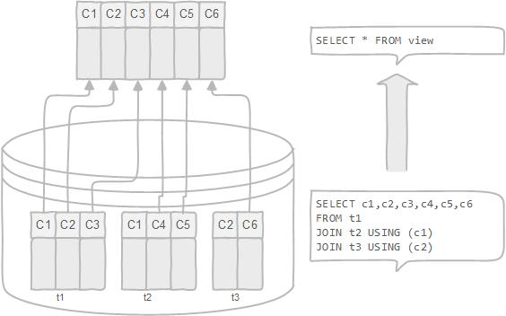

# Views

* A view can be accessed as a virtual table in PostgreSQL.
* A view is named query that provides another way to present data in the database tables.
* A view is defined based on one or more tables, which are known as base tables. When you create a view, you basically create a query and assign it a name, therefore a view is useful for wrapping a commonly used complex query.
* Note that a **normal view** does not store any data except the **materialized view**.
* PostgreSQL does not support removing an existing column in the view, at least up to version 9.4. If you try to do it, you will get an error message: “[Err] ERROR:  cannot drop columns from view”.
* PostgreSQL allows you to append additional columns at the end of the column list. The new columns must have the same names, same data types, and in the same order as they were created.



## Managing PostgreSQL Views

### Creating View

> **SYNTAX**

```SQL
CREATE OR REPLACE VIEW view_name AS query;
```

> **EXAMPLE**

```SQL
CREATE OR REPLACE VIEW customer_master AS
  SELECT cu.customer_id AS id,
    cu.first_name || ' ' || cu.last_name AS name,
    a.address,
    a.postal_code AS "zip code",
    a.phone,
    city.city,
    country.country,
      CASE
        WHEN cu.active THEN 'active'
        ELSE ''
      END AS notes,
    cu.store_id AS sid
  FROM customer cu
    INNER JOIN address a USING (address_id)
    INNER JOIN city USING (city_id)
    INNER JOIN country USING (country_id);
```

```SQL
SELECT * FROM customer_master;
```

### Changing PostgreSQL Views

To change the defining query of a view, you use the CREATE VIEW statement with OR REPLACE addition as follows:

> **SYNTAX**

```SQL
CREATE OR REPLACE view_name
AS query
```

> **EXAMPLE**

```SQL
CREATE OR REPLACE VIEW customer_master AS
  SELECT cu.customer_id AS id,
         cu.first_name || ' ' || cu.last_name AS name,
         a.address,
         a.postal_code AS "zip code",
         a.phone,
         city.city,
         country.country,
            CASE
              WHEN cu.active THEN 'active'
              ELSE ''
            END AS notes,
         cu.store_id AS sid,
         cu.email
  FROM customer cu
    INNER JOIN address a USING (address_id)
    INNER JOIN city USING (city_id)
    INNER JOIN country USING (country_id);
```

```SQL
SELECT * FROM customer_master;
```

To change the definition of a view, you use the ALTER VIEW statement. For example, you can change the name of the view from customer_master to customer_info by using the following statement:

> **EXAMPLE**

```SQL
ALTER VIEW customer_master RENAME TO customer_info;
```

### Removing PostgreSQL Views

> **SYNTAX**

```SQL
DROP VIEW [ IF EXISTS ] view_name;
```

> **EXAMPLE**

```SQL
DROP VIEW IF EXISTS customer_info;
```

## Creating PostgreSQL Updatable Views

A PostgreSQL view is updatable when it meets the following conditions:

* The defining query of the view must have exactly one entry in the FROM clause, which can be a table or another updatable view.
* The defining query must not contain one of the following clauses at the top level: GROUP BY, HAVING, LIMIT, OFFSET, DISTINCT, WITH, UNION, INTERSECT, and EXCEPT.
* The selection list must not contain any window function , any set-returning function, or any aggregate function such as SUM, COUNT, AVG, MIN, and MAX.

1. An updatable view may contain both updatable and non-updatable columns. If you try to insert or update a non-updatable column, PostgreSQL will raise an error.
2. In case you have a WHERE condition in the defining query of a view, you still can update or delete the rows that are not visible through the view. However, if you want to avoid this, you can use CHECK OPTION when you define the view.

> **EXAMPLE**

```SQL
CREATE VIEW usa_cities AS
  SELECT
    city,
    country_id
  FROM city
  WHERE country_id = 103;
```

```SQL
SELECT * FROM usa_cities;
```

```SQL
INSERT INTO usa_cities (city, country_id)
VALUES('San Jose', 103);
```

```SQL
DELETE
FROM usa_cities
WHERE city = 'San Jose';
```

## PostgreSQL Materialized Views

PostgreSQL allows views to store data physically, and we call those views are materialized views. A materialized view caches the result of a complex expensive query and then allow you to refresh this result periodically.

### Creating materialized views

> **SYNTAX**

```SQL
CREATE MATERIALIZED VIEW view_name
AS query
WITH [NO] DATA;
```

1. First, specify the the view_name after the CREATE MATERIALIZED VIEW clause.
2. Second, add the query that gets data from the underlying tables after the AS keyword.
3. Third, if you want to load data into the materialized view at the creation time, you put WITH DATA option, otherwise you put WITH NO DATA. In case you use WITH NO DATA, the view is flagged as unreadable. It means that you cannot query data from the view until you load data into it.

To load data into a materialized view, you use the REFRESH MATERIALIZED VIEW statement as shown below:

> **SYNTAX**

```SQL
REFRESH MATERIALIZED VIEW view_name;
```

When you refresh data for a materialized view, PostgreSQL locks the entire table therefore you cannot query data against it. To avoid this, you can use the CONCURRENTLY option.

> **SYNTAX**

```SQL
REFRESH MATERIALIZED VIEW CONCURRENTLY view_name;
```

> **SYNTAX**

```SQL
DROP MATERIALIZED VIEW view_name;
```

> **EXAMPLE**

```SQL
CREATE MATERIALIZED VIEW rental_by_category
AS
  SELECT c.name AS category,
         sum(p.amount) AS total_sales
  FROM (((((payment p
    JOIN rental r ON ((p.rental_id = r.rental_id)))
    JOIN inventory i ON ((r.inventory_id = i.inventory_id)))
    JOIN film f ON ((i.film_id = f.film_id)))
    JOIN film_category fc ON ((f.film_id = fc.film_id)))
    JOIN category c ON ((fc.category_id = c.category_id)))
  GROUP BY c.name
  ORDER BY sum(p.amount) DESC
WITH NO DATA;
```

```SQL
REFRESH MATERIALIZED VIEW rental_by_category;
```

From now on, we can refresh the data in the rental_by_category view using the REFRESH MATERIALIZED VIEW statement. However, to refresh it with CONCURRENTLY option, we need to create a UNIQUE index for the view first.

```SQL
CREATE UNIQUE INDEX rental_category ON rental_by_category (category);
```

```SQL
REFRESH MATERIALIZED VIEW CONCURRENTLY rental_by_category;
```

## Creating Updatable Views Using the WITH CHECK OPTION Clause

To prevent users from the insert or update a row that not visible through the view, you use the WITH CHECK OPTION clause when creating the view.

> **EXAMPLE**

```SQL
CREATE OR REPLACE VIEW usa_city AS
SELECT
  city_id,
  city,
  country_id
FROM city
WHERE country_id = 103
ORDER BY city
WITH CHECK OPTION;
```

When we used the WITH CASCADED CHECK OPTION for the city_a_usa view, PostgreSQL checked the view-defining condition of the city_a_usa view and also all the underlying views, in this case, it is the city_a view.

> **EXAMPLE**

```SQL
CREATE VIEW city_a AS
SELECT
  city_id,
  city,
  country_id
FROM city
WHERE city LIKE 'A%';
```

```SQL
CREATE OR REPLACE VIEW city_a_usa AS SELECT
  city_id,
  city,
  country_id
FROM city_a
WHERE country_id = 103
WITH CASCADED CHECK OPTION;
```

To check the view-defining condition of the view that you insert or update, you use the WITH LOCAL CHECK OPTION as follows:

```SQL
CREATE OR REPLACE VIEW city_a_usa AS
SELECT
  city_id,
  city,
  country_id
FROM city_a
WHERE country_id = 103
WITH LOCAL CHECK OPTION;
```

## PostgreSQL Recursive View

> **SYNTAX**

```SQL
CREATE RECURSIVE VIEW view_name(columns) AS
SELECT columns;
```

> **SYNTAX**

```SQL
CREATE VIEW view_name AS
WITH RECURSIVE cte_name (columns) AS ( SELECT ... )
SELECT columns FROM cte_name;
```

> **EXAMPLE**

```SQL
CREATE RECURSIVE VIEW reporting_line (employee_id, subordinates) AS
SELECT
  employee_id,
  full_name AS subordinates
FROM employees
WHERE manager_id IS NULL
UNION ALL
  SELECT
    e.employee_id,
    (
      rl.subordinates || ' > ' || e.full_name
    ) AS subordinates
  FROM employees e
  INNER JOIN reporting_line rl ON e.manager_id = rl.employee_id;
```

```SQL
SELECT
  subordinates
FROM reporting_line
WHERE employee_id = 10;
```
